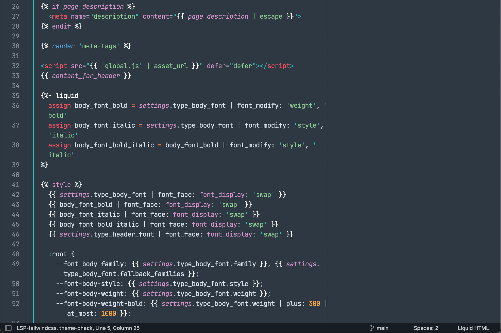

# Shopify Liquid Syntax Highlighting for Sublime Text 4

Light-weight and minimal syntax highlighting for Shopify theme development in Sublime Text 4.

Supports modern Liquid features like `render` and the `liquid` and `style` tags. Supports Liquid-in-CSS, Liquid-in-JS, and JSON in schema.

Based on / huge thanks to:

https://github.com/Shopify/liquid-tm-grammar/ 
https://github.com/braver/sublime-liquid/ 
Sublime’s built-in PHP syntax